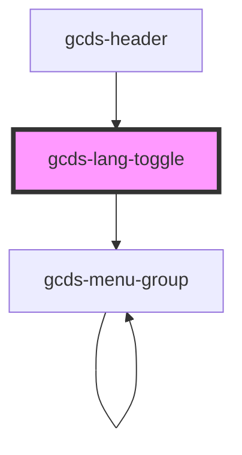

# gcds-lang-toggle

<!-- Auto Generated Below -->

## Properties

| Property            | Attribute | Description                                                        | Type     | Default     |
| ------------------- | --------- | ------------------------------------------------------------------ | -------- | ----------- |
| `href` _(required)_ | `href`    | The href attribute specifies the URL of the opposite language page | `string` | `undefined` |

## Dependencies

### Used by

 - [gcds-header](../gcds-header)

### Depends on

- [gcds-menu-group](../gcds-menu-group)

### Graph

----------------------------------------------

*Built with [StencilJS](https://stenciljs.com/)*
