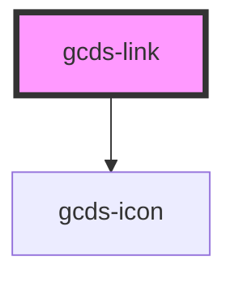

# gcds-link

<!-- Auto Generated Below -->

## Properties

| Property       | Attribute    | Description                                                                                                                                        | Type                                                        | Default     |
| -------------- | ------------ | -------------------------------------------------------------------------------------------------------------------------------------------------- | ----------------------------------------------------------- | ----------- |
| `blurHandler`  | --           | Custom callback function on blur event                                                                                                             | `Function`                                                  | `undefined` |
| `clickHandler` | --           | Custom callback function on click event                                                                                                            | `Function`                                                  | `undefined` |
| `disabled`     | `disabled`   | The disabled attribute for a <link> element.                                                                                                       | `boolean`                                                   | `undefined` |
| `download`     | `download`   | The download attribute specifies that the target (the file specified in the href attribute) will be downloaded when a user clicks on the hyperlink | `string`                                                    | `undefined` |
| `focusHandler` | --           | Custom callback function on focus event                                                                                                            | `Function`                                                  | `undefined` |
| `href`         | `href`       | The href attribute specifies the URL of the page the link goes to                                                                                  | `string`                                                    | `undefined` |
| `linkId`       | `link-id`    | The linkId attribute specifies the id for a <link> element.                                                                                        | `string`                                                    | `undefined` |
| `linkRole`     | `link-role`  | Set the main style                                                                                                                                 | `"danger" \| "primary" \| "secondary" \| "skip-to-content"` | `'primary'` |
| `linkStyle`    | `link-style` | Set the style variant                                                                                                                              | `"solid" \| "text-only"`                                    | `'solid'`   |
| `name`         | `name`       | The name attribute specifies the name for a <link> element.                                                                                        | `string`                                                    | `undefined` |
| `rel`          | `rel`        | The rel attribute specifies the relationship between the current document and the linked document                                                  | `string`                                                    | `undefined` |
| `size`         | `size`       | Set the link size                                                                                                                                  | `"regular" \| "small"`                                      | `'regular'` |
| `target`       | `target`     | The target attribute specifies where to open the linked document                                                                                   | `string`                                                    | `undefined` |

## Events

| Event       | Description                        | Type                |
| ----------- | ---------------------------------- | ------------------- |
| `gcdsBlur`  | Emitted when the link loses focus. | `CustomEvent<void>` |
| `gcdsFocus` | Emitted when the link has focus.   | `CustomEvent<void>` |

## Methods

### `focusElement() => Promise<void>`

Focus element

#### Returns

Type: `Promise<void>`

## Dependencies

### Depends on

- [gcds-icon](../gcds-icon)

### Graph

----------------------------------------------

*Built with [StencilJS](https://stenciljs.com/)*
