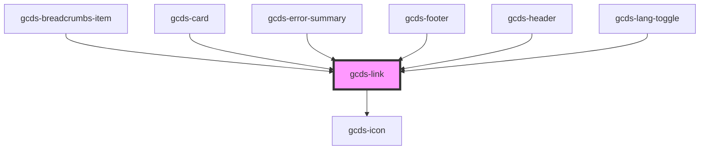

# gcds-link

<!-- Auto Generated Below -->

## Properties

| Property            | Attribute  | Description                                                                                                                                        | Type                                | Default     |
| ------------------- | ---------- | -------------------------------------------------------------------------------------------------------------------------------------------------- | ----------------------------------- | ----------- |
| `display`           | `display`  | Sets the display behavior of the link                                                                                                              | `"block" \| "inline"`               | `'inline'`  |
| `download`          | `download` | The download attribute specifies that the target (the file specified in the href attribute) will be downloaded when a user clicks on the hyperlink | `string`                            | `undefined` |
| `external`          | `external` | Whether the link is external or not                                                                                                                | `boolean`                           | `false`     |
| `href` _(required)_ | `href`     | The href attribute specifies the URL of the page the link goes to                                                                                  | `string`                            | `undefined` |
| `rel`               | `rel`      | The rel attribute specifies the relationship between the current document and the linked document                                                  | `string`                            | `undefined` |
| `size`              | `size`     | Set the link size                                                                                                                                  | `"inherit" \| "regular" \| "small"` | `'inherit'` |
| `target`            | `target`   | The target attribute specifies where to open the linked document                                                                                   | `string`                            | `'_self'`   |
| `type`              | `type`     | The type specifies the media type of the linked document                                                                                           | `string`                            | `undefined` |
| `variant`           | `variant`  | Sets the main style of the link.                                                                                                                   | `"default" \| "light"`              | `'default'` |

## Events

| Event       | Description                             | Type                |
| ----------- | --------------------------------------- | ------------------- |
| `gcdsBlur`  | Emitted when the link loses focus.      | `CustomEvent<void>` |
| `gcdsClick` | Emitted when the link has been clicked. | `CustomEvent<void>` |
| `gcdsFocus` | Emitted when the link has focus.        | `CustomEvent<void>` |

## Dependencies

### Used by

 - [gcds-breadcrumbs-item](../gcds-breadcrumbs)
 - [gcds-card](../gcds-card)
 - [gcds-error-summary](../gcds-error-summary)
 - [gcds-footer](../gcds-footer)
 - [gcds-header](../gcds-header)
 - [gcds-lang-toggle](../gcds-lang-toggle)

### Depends on

- [gcds-icon](../gcds-icon)

### Graph

----------------------------------------------

*Built with [StencilJS](https://stenciljs.com/)*
