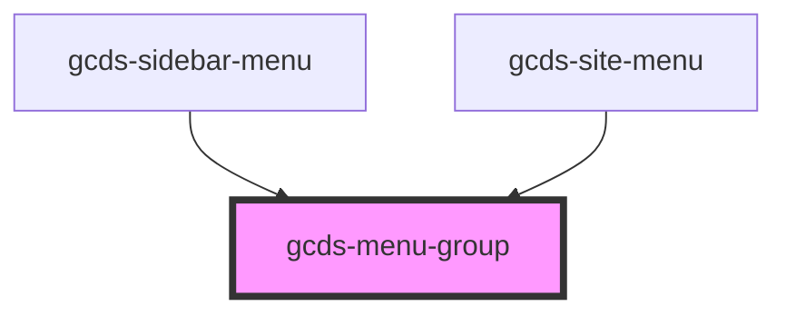

# gcds-menu-group

<!-- Auto Generated Below -->

## Properties

| Property               | Attribute | Description                                           | Type      | Default     |
| ---------------------- | --------- | ----------------------------------------------------- | --------- | ----------- |
| `heading` _(required)_ | `heading` | Heading for the menu group, labels the button trigger | `string`  | `undefined` |
| `open`                 | `open`    | Has the menu group been expanded                      | `boolean` | `false`     |

## Events

| Event       | Description                        | Type                |
| ----------- | ---------------------------------- | ------------------- |
| `gcdsClick` | Emitted when the button has focus. | `CustomEvent<void>` |

## Methods

### `focusTrigger() => Promise<void>`

Focus button element

#### Returns

Type: `Promise<void>`

### `toggleMenu() => Promise<void>`

Toggle the menu open or closed

#### Returns

Type: `Promise<void>`

## Dependencies

### Used by

 - [gcds-sidebar-menu](../gcds-sidebar-menu)
 - [gcds-site-menu](../gcds-site-menu)

### Graph

----------------------------------------------

*Built with [StencilJS](https://stenciljs.com/)*
