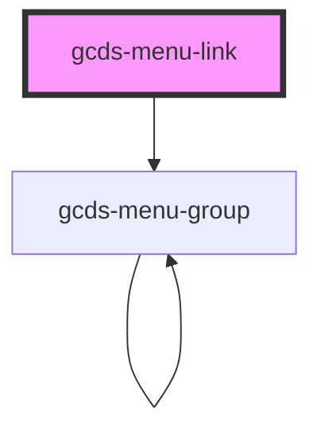

# gcds-menu-link

<!-- Auto Generated Below -->

## Properties

| Property            | Attribute | Description       | Type      | Default     |
| ------------------- | --------- | ----------------- | --------- | ----------- |
| `current`           | `current` | Current page flag | `boolean` | `undefined` |
| `href` _(required)_ | `href`    | Link href         | `string`  | `undefined` |

## Methods

### `focusLink() => Promise<void>`

#### Returns

Type: `Promise<void>`

## Dependencies

### Depends on

- [gcds-menu-group](../gcds-menu-group)

### Graph

----------------------------------------------

*Built with [StencilJS](https://stenciljs.com/)*
