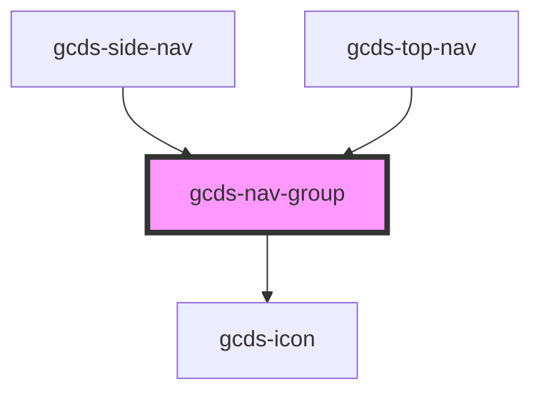

# gcds-nav-group

<!-- Auto Generated Below -->

## Properties

| Property               | Attribute             | Description                                          | Type      | Default     |
| ---------------------- | --------------------- | ---------------------------------------------------- | --------- | ----------- |
| `heading` _(required)_ | `heading`             | Heading for the nav group, labels the button trigger | `string`  | `undefined` |
| `labelTriggerClose`    | `label-trigger-close` | Label for the expanded button trigger                | `string`  | `undefined` |
| `open`                 | `open`                | Has the nav group been expanded                      | `boolean` | `false`     |

## Events

| Event       | Description                        | Type                |
| ----------- | ---------------------------------- | ------------------- |
| `gcdsClick` | Emitted when the button has focus. | `CustomEvent<void>` |

## Methods

### `focusTrigger() => Promise<void>`

Focus button element

#### Returns

Type: `Promise<void>`

### `toggleNav() => Promise<void>`

Toggle the nav open or closed

#### Returns

Type: `Promise<void>`

## Dependencies

### Used by

 - [gcds-side-nav](../gcds-side-nav)
 - [gcds-top-nav](../gcds-top-nav)

### Depends on

- [gcds-icon](../gcds-icon)

### Graph

----------------------------------------------

*Built with [StencilJS](https://stenciljs.com/)*
