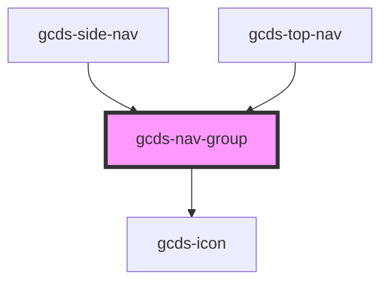

# gcds-nav-group

<!-- Auto Generated Below -->

## Properties

| Property                   | Attribute       | Description                            | Type      | Default     |
| -------------------------- | --------------- | -------------------------------------- | --------- | ----------- |
| `closeTrigger`             | `close-trigger` | Label for the expanded button trigger  | `string`  | `undefined` |
| `menuLabel` _(required)_   | `menu-label`    | Label for the nav group menu           | `string`  | `undefined` |
| `open`                     | `open`          | Has the nav group been expanded        | `boolean` | `false`     |
| `openTrigger` _(required)_ | `open-trigger`  | Label for the collapsed button trigger | `string`  | `undefined` |

## Events

| Event       | Description                               | Type                |
| ----------- | ----------------------------------------- | ------------------- |
| `gcdsBlur`  | Emitted when the button blurs.            | `CustomEvent<void>` |
| `gcdsClick` | Emitted when the button has been clicked. | `CustomEvent<void>` |
| `gcdsFocus` | Emitted when the button has been focus.   | `CustomEvent<void>` |

## Methods

### `focusTrigger() => Promise<void>`

Focus button element

#### Returns

Type: `Promise<void>`

### `toggleNav() => Promise<void>`

Toggle the nav open or closed

#### Returns

Type: `Promise<void>`

## Dependencies

### Used by

 - [gcds-side-nav](../gcds-side-nav)
 - [gcds-top-nav](../gcds-top-nav)

### Depends on

- [gcds-icon](../gcds-icon)

### Graph

----------------------------------------------

*Built with [StencilJS](https://stenciljs.com/)*
