# gcds-nav-link

<!-- Auto Generated Below -->

## Overview

Navigation link within a navigation group or menu, allowing users to navigate to different sections of a website or application.

## Properties

| Property            | Attribute  | Description                         | Type      | Default     |
| ------------------- | ---------- | ----------------------------------- | --------- | ----------- |
| `current`           | `current`  | Current page flag                   | `boolean` | `undefined` |
| `external`          | `external` | Whether the link is external or not | `boolean` | `false`     |
| `href` _(required)_ | `href`     | Link href                           | `string`  | `undefined` |

## Events

| Event       | Description                             | Type                  |
| ----------- | --------------------------------------- | --------------------- |
| `gcdsBlur`  | Emitted when the link loses focus.      | `CustomEvent<void>`   |
| `gcdsClick` | Emitted when the link has been clicked. | `CustomEvent<string>` |
| `gcdsFocus` | Emitted when the link has focus.        | `CustomEvent<void>`   |

## Methods

### `focusLink() => Promise<void>`

Focus the link element

#### Returns

Type: `Promise<void>`

## Slots

| Slot        | Description                           |
| ----------- | ------------------------------------- |
| `"default"` | Slot for the navigation link content. |

## Dependencies

### Depends on

- [gcds-icon](../gcds-icon)

### Graph

```mermaid
graph TD;
  gcds-nav-link --> gcds-icon
  style gcds-nav-link fill:#26374a,stroke:#333,stroke-width:4px
```

----------------------------------------------

*Built with [StencilJS](https://stenciljs.com/)*
