# gcds-nav

<!-- Auto Generated Below -->

## Overview

Navigation for a site or section. Use `variant="top"` for a horizontal header navigation
and `variant="side"` for a vertical navigation next to the page content.
On small screens every gcds-nav on the page is combined into a single menu button.

Links can be passed as `<gcds-nav-link>` and `<gcds-nav-group>` children,
as an `items` array (property or JSON attribute), or as a `<script type="application/json">` child.

## Properties

| Property             | Attribute      | Description                                                                                                                                                                           | Type                       | Default      |
| -------------------- | -------------- | ------------------------------------------------------------------------------------------------------------------------------------------------------------------------------------- | -------------------------- | ------------ |
| `alignment`          | `alignment`    | Alignment of the links in a top navigation                                                                                                                                            | `"end" \| "start"`         | `'start'`    |
| `currentHref`        | `current-href` | URL of the current page. Defaults to the browser URL, or the value passed to setCurrentHref().                                                                                        | `string`                   | `undefined`  |
| `items`              | `items`        | Navigation items. Accepts an array (JavaScript property) or a JSON string (HTML attribute). Format: [{ "label": "About", "href": "/about" }, { "label": "Group", "children": [...] }] | `NavItem[] \| string`      | `undefined`  |
| `label` _(required)_ | `label`        | Label for the navigation landmark                                                                                                                                                     | `string`                   | `undefined`  |
| `mobileMenu`         | `mobile-menu`  | On small screens, combine this navigation with the other navigations on the page into one menu ("combined") or give it its own menu button ("separate").                              | `"combined" \| "separate"` | `'combined'` |
| `variant`            | `variant`      | Navigation style: horizontal top navigation or vertical side navigation                                                                                                               | `"side" \| "top"`          | `'side'`     |

## Events

| Event       | Description                                                                                                                                                                          | Type                              |
| ----------- | ------------------------------------------------------------------------------------------------------------------------------------------------------------------------------------ | --------------------------------- |
| `gcdsClick` | Emitted when a link is clicked. Fired on the source `<gcds-nav-link>` when links are passed as children, otherwise on gcds-nav. Call preventDefault() to handle navigation yourself. | `CustomEvent<GcdsNavClickDetail>` |

## Dependencies

### Depends on

- [gcds-icon](../gcds-icon)

### Graph

```mermaid
graph TD;
  gcds-nav --> gcds-icon
  style gcds-nav fill:#26374a,stroke:#333,stroke-width:4px
```

----------------------------------------------

*Built with [StencilJS](https://stenciljs.com/)*
