# gcds-notice

<!-- Auto Generated Below -->

## Overview

The notice is a short, prominent message that’s part of the page content.

## Properties

| Property                      | Attribute          | Description                                                                                                                                                                                                                                              | Type                                           | Default     |
| ----------------------------- | ------------------ | -------------------------------------------------------------------------------------------------------------------------------------------------------------------------------------------------------------------------------------------------------- | ---------------------------------------------- | ----------- |
| `noticeRole` _(required)_     | `notice-role`      | The notice role property specifies the style of notice to be displayed.                                                                                                                                                                                  | `"danger" \| "info" \| "success" \| "warning"` | `undefined` |
| `noticeTitle` _(required)_    | `notice-title`     | Set the notice title.                                                                                                                                                                                                                                    | `string`                                       | `undefined` |
| `noticeTitleTag` _(required)_ | `notice-title-tag` | The notice title tag property specifies the HTML heading element for the title. This property does not modify the font size. It is used to assign the heading level in order to maintain heading hierarchy and accessibility for assistive technologies. | `"h2" \| "h3" \| "h4" \| "h5"`                 | `undefined` |

## Slots

| Slot        | Description                              |
| ----------- | ---------------------------------------- |
| `"default"` | Slot for the main content of the notice. |

## Dependencies

### Depends on

- [gcds-icon](../gcds-icon)
- [gcds-heading](../gcds-heading)
- [gcds-sr-only](../gcds-sr-only)

### Graph

```mermaid
graph TD;
  gcds-notice --> gcds-icon
  gcds-notice --> gcds-heading
  gcds-notice --> gcds-sr-only
  style gcds-notice fill:#26374a,stroke:#333,stroke-width:4px
```

----------------------------------------------

*Built with [StencilJS](https://stenciljs.com/)*
