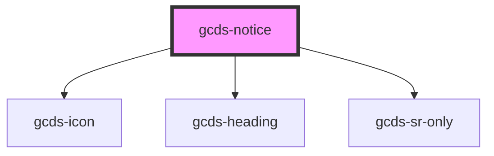

# gcds-notice

<!-- Auto Generated Below -->

## Properties

| Property                      | Attribute          | Description                                                                                                                                                                                                                                         | Type                                           | Default     |
| ----------------------------- | ------------------ | --------------------------------------------------------------------------------------------------------------------------------------------------------------------------------------------------------------------------------------------------- | ---------------------------------------------- | ----------- |
| `noticeTitle` _(required)_    | `notice-title`     | Set the notice title.                                                                                                                                                                                                                               | `string`                                       | `undefined` |
| `noticeTitleTag` _(required)_ | `notice-title-tag` | The notice title tag defines the HTML element used for the title. While the font size remains the same regardless of the tag, it’s important for accessibility to set the correct heading level to maintain a proper heading hierarchy on the page. | `"h2" \| "h3" \| "h4" \| "h5"`                 | `undefined` |
| `type` _(required)_           | `type`             | Set notice type.                                                                                                                                                                                                                                    | `"danger" \| "info" \| "success" \| "warning"` | `undefined` |

## Dependencies

### Depends on

- [gcds-icon](../gcds-icon)
- [gcds-heading](../gcds-heading)
- [gcds-sr-only](../gcds-sr-only)

### Graph

----------------------------------------------

*Built with [StencilJS](https://stenciljs.com/)*
