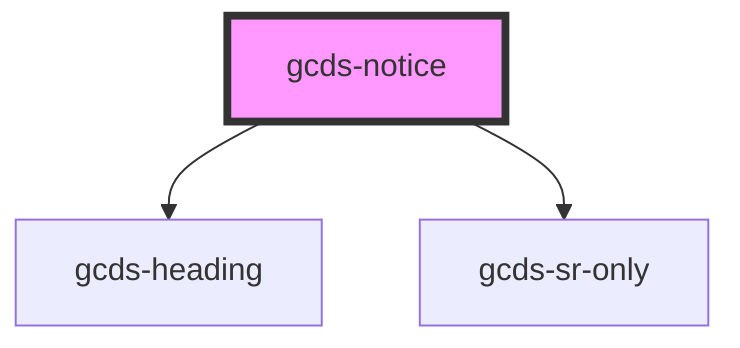

# gcds-notice

<!-- Auto Generated Below -->

## Properties

| Property                   | Attribute      | Description               | Type                                           | Default     |
| -------------------------- | -------------- | ------------------------- | ---------------------------------------------- | ----------- |
| `noticeTitle` _(required)_ | `notice-title` | Defines the notice title. | `string`                                       | `undefined` |
| `type` _(required)_        | `type`         | Defines notice role.      | `"danger" \| "info" \| "success" \| "warning"` | `undefined` |

## Dependencies

### Depends on

- [gcds-heading](../gcds-heading)
- [gcds-sr-only](../gcds-sr-only)

### Graph

----------------------------------------------

*Built with [StencilJS](https://stenciljs.com/)*
