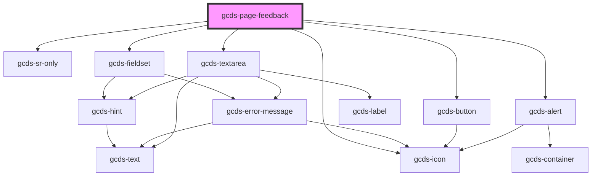

# gcds-text

<!-- Auto Generated Below -->

## Properties

| Property         | Attribute         | Description                                                                                                         | Type                                                                                                                                         | Default     |
| ---------------- | ----------------- | ------------------------------------------------------------------------------------------------------------------- | -------------------------------------------------------------------------------------------------------------------------------------------- | ----------- |
| `characterLimit` | `character-limit` | Sets the line length to a maximum amount of characters per line to ensure a comfortable, accessible reading length. | `boolean`                                                                                                                                    | `true`      |
| `display`        | `display`         | Specifies the display behaviour of the text.                                                                        | `"block" \| "flex" \| "inline" \| "inline-block" \| "inline-flex" \| "none"`                                                                 | `'block'`   |
| `marginBottom`   | `margin-bottom`   | Adds margin below the text.                                                                                         | `"0" \| "100" \| "1000" \| "150" \| "200" \| "250" \| "300" \| "400" \| "450" \| "50" \| "500" \| "550" \| "600" \| "700" \| "800" \| "900"` | `'400'`     |
| `marginTop`      | `margin-top`      | Adds margin above the text.                                                                                         | `"0" \| "100" \| "1000" \| "150" \| "200" \| "250" \| "300" \| "400" \| "450" \| "50" \| "500" \| "550" \| "600" \| "700" \| "800" \| "900"` | `'0'`       |
| `size`           | `size`            | Sets the appropriate HTML tags for the selected size.                                                               | `"body" \| "caption"`                                                                                                                        | `'body'`    |
| `textRole`       | `text-role`       | Sets the main style of the text.                                                                                    | `"light" \| "primary" \| "secondary"`                                                                                                        | `'primary'` |

## Shadow Parts

| Part     | Description |
| -------- | ----------- |
| `"text"` |             |

## Dependencies

### Depends on

- [gcds-sr-only](../gcds-sr-only)
- [gcds-fieldset](../gcds-fieldset)
- [gcds-button](../gcds-button)
- [gcds-textarea](../gcds-textarea)
- [gcds-icon](../gcds-icon)
- [gcds-alert](../gcds-alert)

### Graph

----------------------------------------------

*Built with [StencilJS](https://stenciljs.com/)*
