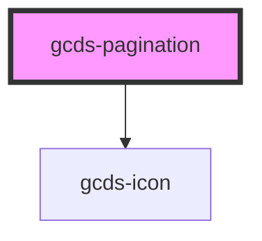

# gcds-pagination

<!-- Auto Generated Below -->

## Properties

| Property             | Attribute        | Description                                                             | Type                 | Default     |
| -------------------- | ---------------- | ----------------------------------------------------------------------- | -------------------- | ----------- |
| `currentPage`        | `current-page`   | List display - Current page number                                      | `number`             | `undefined` |
| `display`            | `display`        | Navigation element label                                                | `"list" \| "simple"` | `'list'`    |
| `label` _(required)_ | `label`          | Navigation element label                                                | `string`             | `undefined` |
| `nextHref`           | `next-href`      | Simple display - href for next link                                     | `string`             | `undefined` |
| `nextLabel`          | `next-label`     | Simple display - lable for next link                                    | `string`             | `undefined` |
| `previousHref`       | `previous-href`  | Simple display - href for previous link                                 | `string`             | `undefined` |
| `previousLabel`      | `previous-label` | Simple display - label for previous link                                | `string`             | `undefined` |
| `totalPages`         | `total-pages`    | List display - Total number of pages                                    | `number`             | `undefined` |
| `url`                | `url`            | List display - URL object to create query strings and fragment on links | `object \| string`   | `undefined` |

## Events

| Event       | Description                             | Type                |
| ----------- | --------------------------------------- | ------------------- |
| `gcdsBlur`  | Emitted when the link loses focus.      | `CustomEvent<void>` |
| `gcdsClick` | Emitted when the link has been clicked. | `CustomEvent<void>` |
| `gcdsFocus` | Emitted when the link has focus.        | `CustomEvent<void>` |

## Dependencies

### Depends on

- [gcds-icon](../gcds-icon)

### Graph

----------------------------------------------

*Built with [StencilJS](https://stenciljs.com/)*
