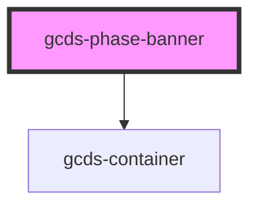

# gcds-phase-banner

<!-- Auto Generated Below -->

## Properties

| Property     | Attribute     | Description                                             | Type                                             | Default     |
| ------------ | ------------- | ------------------------------------------------------- | ------------------------------------------------ | ----------- |
| `bannerRole` | `banner-role` | Defines banner role.                                    | `"primary" \| "secondary"`                       | `'primary'` |
| `container`  | `container`   | Defines the container width of the phase banner content | `"full" \| "lg" \| "md" \| "sm" \| "xl" \| "xs"` | `'xl'`      |
| `isFixed`    | `is-fixed`    | Defines if the banner's position is fixed.              | `boolean`                                        | `undefined` |

## Dependencies

### Depends on

- [gcds-container](../gcds-container)

### Graph

----------------------------------------------

*Built with [StencilJS](https://stenciljs.com/)*
