# gcds-phase-banner

<!-- Auto Generated Below -->

## Overview

Phase banner displays a banner indicating the current phase of a project or feature, with optional icons and call-to-action elements.

## Properties

| Property     | Attribute     | Description                                             | Type                                             | Default     |
| ------------ | ------------- | ------------------------------------------------------- | ------------------------------------------------ | ----------- |
| `bannerRole` | `banner-role` | Defines banner role.                                    | `"primary" \| "secondary"`                       | `'primary'` |
| `container`  | `container`   | Defines the container width of the phase banner content | `"full" \| "lg" \| "md" \| "sm" \| "xl" \| "xs"` | `'xl'`      |
| `isFixed`    | `is-fixed`    | Defines if the banner's position is fixed.              | `boolean`                                        | `undefined` |

## Slots

| Slot                  | Description                                                   |
| --------------------- | ------------------------------------------------------------- |
| `"banner-cta"`        | Slot for the call-to-action element in the banner.            |
| `"banner-icon-left"`  | Slot for displaying an icon/image on the left of the banner.  |
| `"banner-icon-right"` | Slot for displaying an icon/image on the right of the banner. |
| `"banner-text"`       | Slot for the main content of the banner.                      |

## Dependencies

### Depends on

- [gcds-container](../gcds-container)

### Graph

```mermaid
graph TD;
  gcds-phase-banner --> gcds-container
  style gcds-phase-banner fill:#26374a,stroke:#333,stroke-width:4px
```

----------------------------------------------

*Built with [StencilJS](https://stenciljs.com/)*
