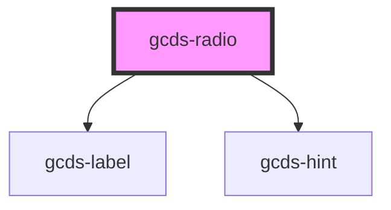

# gcds-radio

<!-- Auto Generated Below -->

## Properties

| Property               | Attribute | Description                          | Type                      | Default     |
| ---------------------- | --------- | ------------------------------------ | ------------------------- | ----------- |
| `name` _(required)_    | `name`    | Name attribute for an input element. | `string`                  | `undefined` |
| `options` _(required)_ | `options` | Options to render radio buttons      | `RadioObject[] \| string` | `undefined` |

## Events

| Event             | Description                              | Type                |
| ----------------- | ---------------------------------------- | ------------------- |
| `gcdsBlur`        | Emitted when the radio loses focus.      | `CustomEvent<void>` |
| `gcdsFocus`       | Emitted when the radio has focus.        | `CustomEvent<void>` |
| `gcdsRadioChange` | Emitted when the radio button is checked | `CustomEvent<void>` |

## Dependencies

### Depends on

- [gcds-label](../gcds-label)
- [gcds-hint](../gcds-hint)

### Graph

----------------------------------------------

*Built with [StencilJS](https://stenciljs.com/)*
