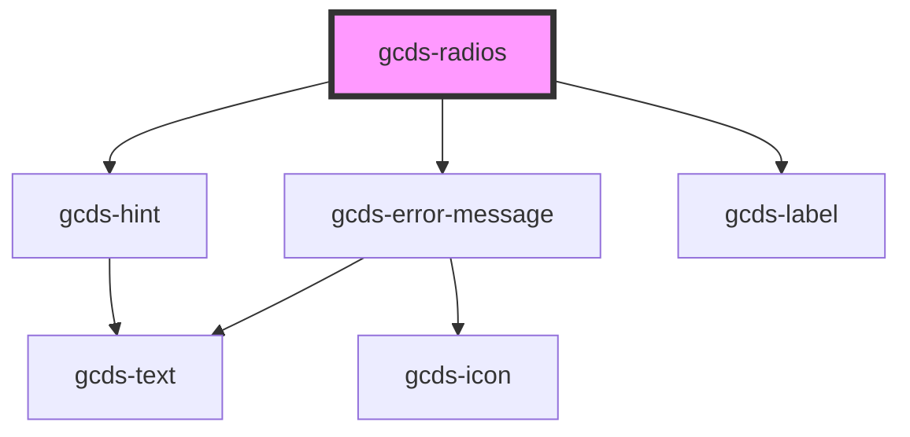

# gcds-radio

<!-- Auto Generated Below -->

## Properties

| Property               | Attribute       | Description                                       | Type                                                | Default     |
| ---------------------- | --------------- | ------------------------------------------------- | --------------------------------------------------- | ----------- |
| `disabled`             | `disabled`      | Specifies if an input element is disabled or not. | `boolean`                                           | `undefined` |
| `errorMessage`         | `error-message` | Error message for invalid radio buttons.          | `string`                                            | `undefined` |
| `hint`                 | `hint`          | Specifies if a form field is required or not.     | `string`                                            | `undefined` |
| `legend` _(required)_  | `legend`        | Name of the form field group.                     | `string`                                            | `undefined` |
| `name` _(required)_    | `name`          | Name attribute for an input element.              | `string`                                            | `undefined` |
| `options` _(required)_ | `options`       | Options to render radio buttons                   | `RadioObject[] \| string`                           | `undefined` |
| `required`             | `required`      | Specifies if a form field is required or not.     | `boolean`                                           | `undefined` |
| `validateOn`           | `validate-on`   | Set event to call validator                       | `"blur" \| "other" \| "submit"`                     | `undefined` |
| `validator`            | --              | Array of validators                               | `(string \| ValidatorEntry \| Validator<string>)[]` | `undefined` |
| `value`                | `value`         | Specifies if an input element is disabled or not. | `string`                                            | `undefined` |

## Events

| Event        | Description                                     | Type                  |
| ------------ | ----------------------------------------------- | --------------------- |
| `gcdsBlur`   | Emitted when the radio loses focus.             | `CustomEvent<void>`   |
| `gcdsChange` | Emitted when the radio button is checked        | `CustomEvent<void>`   |
| `gcdsError`  | Emitted when the radios has a validation error. | `CustomEvent<object>` |
| `gcdsFocus`  | Emitted when the radio has focus.               | `CustomEvent<void>`   |
| `gcdsInput`  | Emitted when the radio button is checked        | `CustomEvent<void>`   |
| `gcdsValid`  | Emitted when the radios has passed validation.  | `CustomEvent<void>`   |

## Methods

### `validate() => Promise<void>`

Call any active validators

#### Returns

Type: `Promise<void>`

## Dependencies

### Depends on

- [gcds-hint](../gcds-hint)
- [gcds-error-message](../gcds-error-message)
- [gcds-label](../gcds-label)

### Graph

----------------------------------------------

*Built with [StencilJS](https://stenciljs.com/)*
