# gcds-radio

<!-- Auto Generated Below -->

## Overview

Radios provide a set of options for a single response.

## Properties

| Property               | Attribute       | Description                                                                                                             | Type                                                | Default     |
| ---------------------- | --------------- | ----------------------------------------------------------------------------------------------------------------------- | --------------------------------------------------- | ----------- |
| `disabled`             | `disabled`      | Specifies if an input element is disabled or not.                                                                       | `boolean`                                           | `undefined` |
| `errorMessage`         | `error-message` | Set this to display an error message for invalid radios                                                                 | `string`                                            | `undefined` |
| `hint`                 | `hint`          | Hint displayed below the label and above the radio elements                                                             | `string`                                            | `undefined` |
| `legend` _(required)_  | `legend`        | Label or legend for the group of radio elements                                                                         | `string`                                            | `undefined` |
| `name` _(required)_    | `name`          | The `name` attribute for the radios, used to group radio elements together                                              | `string`                                            | `undefined` |
| `options` _(required)_ | `options`       | Options to render radio buttons                                                                                         | `RadioObject[] \| string`                           | `undefined` |
| `required`             | `required`      | Specifies if a form field is required or not.                                                                           | `boolean`                                           | `undefined` |
| `validateOn`           | `validate-on`   | Set event to call validator                                                                                             | `"blur" \| "other" \| "submit"`                     | `'blur'`    |
| `validator`            | `validator`     | Array of validators                                                                                                     | `(string \| ValidatorEntry \| Validator<string>)[]` | `undefined` |
| `validity`             | `validity`      | Read-only property of the input, returns a ValidityState object that represents the validity states this element is in. | `ValidityState`                                     | `undefined` |
| `value`                | `value`         | Default value for the element                                                                                           | `string`                                            | `undefined` |

## Events

| Event        | Description                                                                                                                                     | Type                  |
| ------------ | ----------------------------------------------------------------------------------------------------------------------------------------------- | --------------------- |
| `gcdsBlur`   | Emitted when the radios has lost focus                                                                                                          | `CustomEvent<void>`   |
| `gcdsChange` | Emitted when a radios option is checked (but not when unchecked). Contains new value in event detail                                            | `CustomEvent<string>` |
| `gcdsError`  | Emitted when radios has a validation error                                                                                                      | `CustomEvent<object>` |
| `gcdsFocus`  | Emitted when radios has received focus                                                                                                          | `CustomEvent<void>`   |
| `gcdsInput`  | Emitted when radios has been changed as a direct result of a user action (a radio option has been selected). Contains new value in event detail | `CustomEvent<string>` |
| `gcdsValid`  | Emitted when radios has passed validation                                                                                                       | `CustomEvent<void>`   |

## Methods

### `checkValidity() => Promise<boolean>`

Check the validity of gcds-radios

#### Returns

Type: `Promise<boolean>`

### `getValidationMessage() => Promise<string>`

Get validationMessage of gcds-radios

#### Returns

Type: `Promise<string>`

### `validate() => Promise<void>`

Call any active validators

#### Returns

Type: `Promise<void>`

## Dependencies

### Depends on

- [gcds-hint](../gcds-hint)
- [gcds-error-message](../gcds-error-message)
- [gcds-label](../gcds-label)

### Graph

```mermaid
graph TD;
  gcds-radios --> gcds-hint
  gcds-radios --> gcds-error-message
  gcds-radios --> gcds-label
  gcds-hint --> gcds-text
  gcds-error-message --> gcds-text
  gcds-error-message --> gcds-icon
  style gcds-radios fill:#26374a,stroke:#333,stroke-width:4px
```

----------------------------------------------

*Built with [StencilJS](https://stenciljs.com/)*
