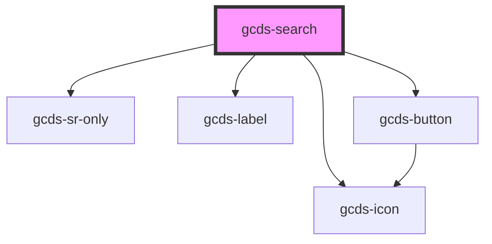

# gcds-search

<!-- Auto Generated Below -->

## Properties

| Property      | Attribute     | Description                                                                        | Type              | Default          |
| ------------- | ------------- | ---------------------------------------------------------------------------------- | ----------------- | ---------------- |
| `action`      | `action`      | Sets the action for the search form. Default will be canada.ca global search       | `string`          | `'/sr/srb.html'` |
| `method`      | `method`      | Set the form method of the search form                                             | `"get" \| "post"` | `'get'`          |
| `name`        | `name`        | Set the name of the search input                                                   | `string`          | `'q'`            |
| `placeholder` | `placeholder` | Set the placeholder and label for the search input. Becomes "Search [placeholder]" | `string`          | `'Canada.ca'`    |
| `searchId`    | `search-id`   | Set the id of the search input                                                     | `string`          | `'search'`       |
| `suggested`   | --            | Set a list of predefined search terms                                              | `string[]`        | `undefined`      |
| `value`       | `value`       | Set the value of the search input                                                  | `string`          | `undefined`      |

## Events

| Event        | Description                                           | Type                  |
| ------------ | ----------------------------------------------------- | --------------------- |
| `gcdsBlur`   | Emitted when the search input has lost focus.         | `CustomEvent<object>` |
| `gcdsChange` | Emitted when the search input value has changed.      | `CustomEvent<string>` |
| `gcdsFocus`  | Emitted when the search input value has gained focus. | `CustomEvent<object>` |
| `gcdsInput`  | Emitted when the search element has recieved input.   | `CustomEvent<string>` |
| `gcdsSubmit` | Emitted when the search form has submitted.           | `CustomEvent<object>` |

## Dependencies

### Depends on

- [gcds-sr-only](../gcds-sr-only)
- [gcds-label](../gcds-label)
- [gcds-button](../gcds-button)
- [gcds-icon](../gcds-icon)

### Graph

----------------------------------------------

*Built with [StencilJS](https://stenciljs.com/)*
