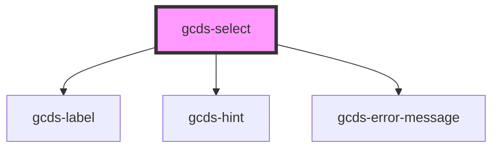

# gcds-select

<!-- Auto Generated Below -->

## Properties

| Property                | Attribute       | Description                                                                                   | Type                                                | Default     |
| ----------------------- | --------------- | --------------------------------------------------------------------------------------------- | --------------------------------------------------- | ----------- |
| `blurHandler`           | --              | Custom callback function on blur event                                                        | `Function`                                          | `undefined` |
| `changeHandler`         | --              | Custom callback function on change event                                                      | `Function`                                          | `undefined` |
| `defaultValue`          | `default-value` | The default value is an optional value that gets displayed before the user selects an option. | `string`                                            | `undefined` |
| `disabled`              | `disabled`      | Specifies if a select element is disabled or not.                                             | `boolean`                                           | `false`     |
| `errorMessage`          | `error-message` | Error message for an invalid select element.                                                  | `string`                                            | `undefined` |
| `focusHandler`          | --              | Custom callback function on focus event                                                       | `Function`                                          | `undefined` |
| `hint`                  | `hint`          | Hint displayed below the label.                                                               | `string`                                            | `undefined` |
| `label` _(required)_    | `label`         | Form field label.                                                                             | `string`                                            | `undefined` |
| `required`              | `required`      | Specifies if a form field is required or not.                                                 | `boolean`                                           | `false`     |
| `selectId` _(required)_ | `select-id`     | Id attribute for a select element.                                                            | `string`                                            | `undefined` |
| `validateOn`            | `validate-on`   | Set event to call validator                                                                   | `"blur" \| "other" \| "submit"`                     | `undefined` |
| `validator`             | --              | Array of validators                                                                           | `(string \| ValidatorEntry \| Validator<string>)[]` | `undefined` |
| `value`                 | `value`         | Value for a select element.                                                                   | `string`                                            | `undefined` |

## Events

| Event              | Description                                    | Type                      |
| ------------------ | ---------------------------------------------- | ------------------------- |
| `gcdsBlur`         | Emitted when the select loses focus.           | `CustomEvent<void>`       |
| `gcdsError`        | Emitted when the input has a validation error. | `CustomEvent<IGcdsError>` |
| `gcdsFocus`        | Emitted when the select has focus.             | `CustomEvent<void>`       |
| `gcdsSelectChange` | Update value based on user selection.          | `CustomEvent<any>`        |

## Methods

### `validate() => Promise<void>`

Call any active validators

#### Returns

Type: `Promise<void>`

## Dependencies

### Depends on

- [gcds-label](../gcds-label)
- [gcds-hint](../gcds-hint)
- [gcds-error-message](../gcds-error-message)

### Graph

----------------------------------------------

*Built with [StencilJS](https://stenciljs.com/)*
