# gcds-select

<!-- Auto Generated Below -->

## Overview

A select provides a large list of options for single selection.

## Properties

| Property                | Attribute       | Description                                                                                   | Type                                                | Default     |
| ----------------------- | --------------- | --------------------------------------------------------------------------------------------- | --------------------------------------------------- | ----------- |
| `defaultValue`          | `default-value` | The default value is an optional value that gets displayed before the user selects an option. | `string`                                            | `undefined` |
| `disabled`              | `disabled`      | Specifies if a select element is disabled or not.                                             | `boolean`                                           | `false`     |
| `errorMessage`          | `error-message` | Error message for an invalid select element.                                                  | `string`                                            | `undefined` |
| `hint`                  | `hint`          | Hint displayed below the label.                                                               | `string`                                            | `undefined` |
| `label` _(required)_    | `label`         | Form field label.                                                                             | `string`                                            | `undefined` |
| `name` _(required)_     | `name`          | Name attribute for select form element.                                                       | `string`                                            | `undefined` |
| `required`              | `required`      | Specifies if a form field is required or not.                                                 | `boolean`                                           | `false`     |
| `selectId` _(required)_ | `select-id`     | Id attribute for a select element.                                                            | `string`                                            | `undefined` |
| `validateOn`            | `validate-on`   | Set event to call validator                                                                   | `"blur" \| "other" \| "submit"`                     | `'blur'`    |
| `validator`             | `validator`     | Array of validators                                                                           | `(string \| ValidatorEntry \| Validator<string>)[]` | `undefined` |
| `value`                 | `value`         | Value for a select element.                                                                   | `string`                                            | `undefined` |

## Events

| Event        | Description                                     | Type                  |
| ------------ | ----------------------------------------------- | --------------------- |
| `gcdsBlur`   | Emitted when the select loses focus.            | `CustomEvent<void>`   |
| `gcdsChange` | Emitted when the select value has changed.      | `CustomEvent<string>` |
| `gcdsError`  | Emitted when the select has a validation error. | `CustomEvent<object>` |
| `gcdsFocus`  | Emitted when the select has focus.              | `CustomEvent<void>`   |
| `gcdsInput`  | Emitted when the select has received input.     | `CustomEvent<string>` |
| `gcdsValid`  | Emitted when the select has a validation error. | `CustomEvent<object>` |

## Methods

### `validate() => Promise<void>`

Call any active validators

#### Returns

Type: `Promise<void>`

## Slots

| Slot        | Description                         |
| ----------- | ----------------------------------- |
| `"default"` | Slot for options and option groups. |

## Dependencies

### Used by

 - [gcds-date-input](../gcds-date-input)

### Depends on

- [gcds-label](../gcds-label)
- [gcds-hint](../gcds-hint)
- [gcds-error-message](../gcds-error-message)

### Graph

```mermaid
graph TD;
  gcds-select --> gcds-label
  gcds-select --> gcds-hint
  gcds-select --> gcds-error-message
  gcds-hint --> gcds-text
  gcds-error-message --> gcds-text
  gcds-error-message --> gcds-icon
  gcds-date-input --> gcds-select
  style gcds-select fill:#26374a,stroke:#333,stroke-width:4px
```

----------------------------------------------

*Built with [StencilJS](https://stenciljs.com/)*
