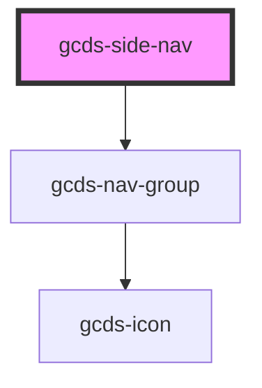

# gcds-side-nav

<!-- Auto Generated Below -->

## Properties

| Property             | Attribute | Description                   | Type     | Default     |
| -------------------- | --------- | ----------------------------- | -------- | ----------- |
| `label` _(required)_ | `label`   | Label for navigation landmark | `string` | `undefined` |

## Methods

### `getNavSize() => Promise<"desktop" | "mobile">`

#### Returns

Type: `Promise<"desktop" | "mobile">`

### `updateNavItemQueue(el: any, includeElement?: boolean) => Promise<void>`

#### Parameters

| Name             | Type      | Description |
| ---------------- | --------- | ----------- |
| `el`             | `any`     |             |
| `includeElement` | `boolean` |             |

#### Returns

Type: `Promise<void>`

### `updateNavSize(size: any) => Promise<void>`

#### Parameters

| Name   | Type  | Description |
| ------ | ----- | ----------- |
| `size` | `any` |             |

#### Returns

Type: `Promise<void>`

## Dependencies

### Depends on

- [gcds-nav-group](../gcds-nav-group)

### Graph

----------------------------------------------

*Built with [StencilJS](https://stenciljs.com/)*
