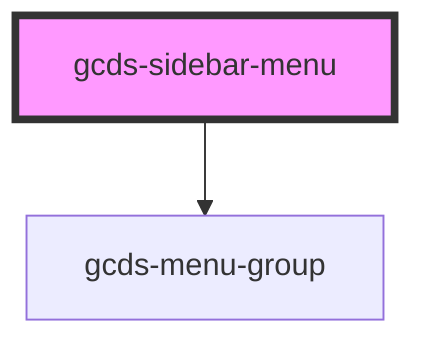

# gcds-sidebar-menu

<!-- Auto Generated Below -->

## Properties

| Property             | Attribute  | Description                   | Type                   | Default     |
| -------------------- | ---------- | ----------------------------- | ---------------------- | ----------- |
| `label` _(required)_ | `label`    | Label for navigation landmark | `string`               | `undefined` |
| `position`           | `position` | Sticky navigation flag        | `"static" \| "sticky"` | `'static'`  |

## Methods

### `updateMenuItemQueue(el: any, includeElement?: boolean) => Promise<void>`

#### Returns

Type: `Promise<void>`

### `updateMenuSize(size: any) => Promise<void>`

#### Returns

Type: `Promise<void>`

## Dependencies

### Depends on

- [gcds-menu-group](../gcds-menu-group)

### Graph

----------------------------------------------

*Built with [StencilJS](https://stenciljs.com/)*
