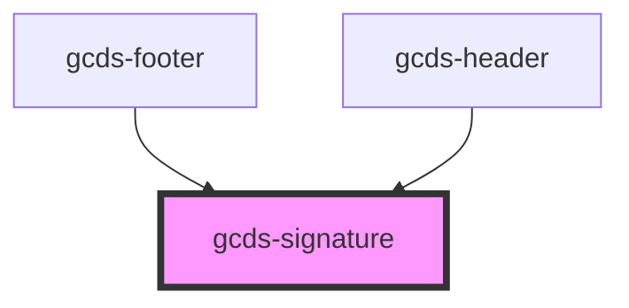

# gcds-signature

<!-- Auto Generated Below -->

## Properties

| Property  | Attribute  | Description                                      | Type                        | Default       |
| --------- | ---------- | ------------------------------------------------ | --------------------------- | ------------- |
| `hasLink` | `has-link` | Has link to canada.ca. Only applies to signature | `boolean`                   | `false`       |
| `type`    | `type`     | The type of graphic to render                    | `"signature" \| "wordmark"` | `'signature'` |
| `variant` | `variant`  | The colour variant to render                     | `"colour" \| "white"`       | `'colour'`    |

## Dependencies

### Used by

 - [gcds-footer](../gcds-footer)
 - [gcds-header](../gcds-header)

### Graph

----------------------------------------------

*Built with [StencilJS](https://stenciljs.com/)*
