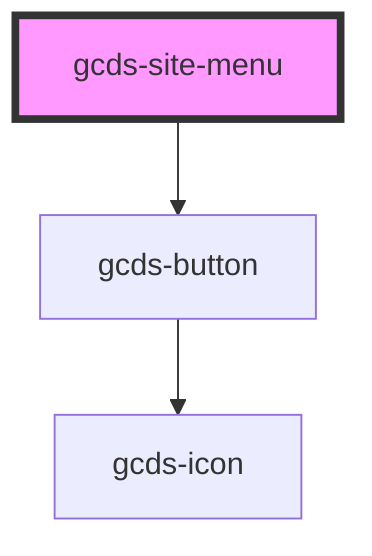

# gcds-site-menu

<!-- Auto Generated Below -->

## Properties

| Property                         | Attribute             | Description            | Type                                       | Default     |
| -------------------------------- | --------------------- | ---------------------- | ------------------------------------------ | ----------- |
| `menuAlignment`                  | `menu-alignment`      | Menu alignment         | `"center" \| "left" \| "right" \| "split"` | `'left'`    |
| `menuDesktopLayout` _(required)_ | `menu-desktop-layout` | Desktop layout         | `"sidebar" \| "topbar"`                    | `undefined` |
| `menuMobileLayout` _(required)_  | `menu-mobile-layout`  | Mobile layout          | `"drawer"`                                 | `undefined` |
| `menuPosition`                   | `menu-position`       | Sticky navigation flag | `"static" \| "sticky"`                     | `'static'`  |

## Dependencies

### Depends on

- [gcds-button](../gcds-button)

### Graph

----------------------------------------------

*Built with [StencilJS](https://stenciljs.com/)*
