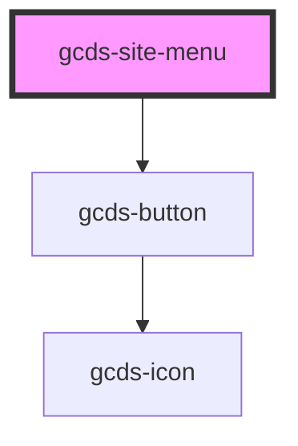

# gcds-site-menu

<!-- Auto Generated Below -->

## Properties

| Property                     | Attribute        | Description            | Type                                       | Default     |
| ---------------------------- | ---------------- | ---------------------- | ------------------------------------------ | ----------- |
| `alignment`                  | `alignment`      | Menu alignment         | `"center" \| "left" \| "right" \| "split"` | `'left'`    |
| `desktopLayout` _(required)_ | `desktop-layout` | Desktop layout         | `"sidebar" \| "topbar"`                    | `undefined` |
| `mobileLayout` _(required)_  | `mobile-layout`  | Mobile layout          | `"drawer"`                                 | `undefined` |
| `position`                   | `position`       | Sticky navigation flag | `"static" \| "sticky"`                     | `'static'`  |

## Dependencies

### Depends on

- [gcds-button](../gcds-button)

### Graph

----------------------------------------------

*Built with [StencilJS](https://stenciljs.com/)*
