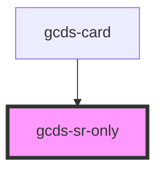

# gcds-sr-only

<!-- Auto Generated Below -->

## Properties

| Property | Attribute | Description                                    | Type                                                            | Default |
| -------- | --------- | ---------------------------------------------- | --------------------------------------------------------------- | ------- |
| `tag`    | `tag`     | Sets the appropriate HTML tag for the content. | `"h1" \| "h2" \| "h3" \| "h4" \| "h5" \| "h6" \| "p" \| "span"` | `'p'`   |

## Dependencies

### Used by

 - [gcds-card](../gcds-card)

### Graph

----------------------------------------------

*Built with [StencilJS](https://stenciljs.com/)*
