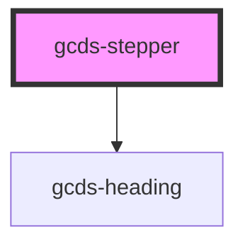

# gcds-stepper

<!-- Auto Generated Below -->

## Properties

| Property                   | Attribute      | Description                        | Type     | Default     |
| -------------------------- | -------------- | ---------------------------------- | -------- | ----------- |
| `currentStep` _(required)_ | `current-step` | Defines the current step.          | `number` | `undefined` |
| `totalSteps` _(required)_  | `total-steps`  | Defines the total amount of steps. | `number` | `undefined` |

## Dependencies

### Depends on

- [gcds-heading](../gcds-heading)

### Graph

----------------------------------------------

*Built with [StencilJS](https://stenciljs.com/)*
