# gcds-stepper

<!-- Auto Generated Below -->

## Overview

A stepper is a progress tracker for a multi-step process.

## Properties

| Property                   | Attribute      | Description                        | Type                   | Default     |
| -------------------------- | -------------- | ---------------------------------- | ---------------------- | ----------- |
| `currentStep` _(required)_ | `current-step` | Defines the current step.          | `number`               | `undefined` |
| `tag`                      | `tag`          | Defines the heading tag to render  | `"h1" \| "h2" \| "h3"` | `'h2'`      |
| `totalSteps` _(required)_  | `total-steps`  | Defines the total amount of steps. | `number`               | `undefined` |

## Slots

| Slot | Description                   |
| ---- | ----------------------------- |
|      | Slot for the heading content. |

## Dependencies

### Depends on

- [gcds-heading](../gcds-heading)
- [gcds-sr-only](../gcds-sr-only)

### Graph

```mermaid
graph TD;
  gcds-stepper --> gcds-heading
  gcds-stepper --> gcds-sr-only
  style gcds-stepper fill:#26374a,stroke:#333,stroke-width:4px
```

----------------------------------------------

*Built with [StencilJS](https://stenciljs.com/)*
