# gcds-table

<!-- Auto Generated Below -->

## Properties

| Property                | Attribute                 | Description                                                 | Type                      | Default           |
| ----------------------- | ------------------------- | ----------------------------------------------------------- | ------------------------- | ----------------- |
| `caption`               | `caption`                 | Table caption                                               | `string`                  | `undefined`       |
| `columns`               | `columns`                 | Column definitions                                          | `TableColumn[] \| string` | `[]`              |
| `data`                  | `data`                    | Row data                                                    | `object[] \| string`      | `[]`              |
| `pagination`            | `pagination`              | Enable pagination                                           | `boolean`                 | `false`           |
| `paginationCurrentPage` | `pagination-current-page` | Current page index                                          | `number`                  | `1`               |
| `paginationSize`        | `pagination-size`         | Number of rows per page                                     | `number`                  | `10`              |
| `paginationSizeOptions` | `pagination-size-options` | Available page-size options. Use 0 to represent "All rows". | `number[] \| string`      | `[10, 25, 50, 0]` |
| `search`                | `search`                  | Enable global search / filter                               | `boolean`                 | `false`           |
| `searchValue`           | `search-value`            | Current search string                                       | `string`                  | `''`              |
| `sort`                  | `sort`                    | Enable global column sorting (can be overridden per column) | `boolean`                 | `false`           |

## Dependencies

### Depends on

- [gcds-input](../gcds-input)
- [gcds-select](../gcds-select)
- [gcds-pagination](../gcds-pagination)

### Graph

```mermaid
graph TD;
  gcds-table --> gcds-input
  gcds-table --> gcds-select
  gcds-table --> gcds-pagination
  gcds-input --> gcds-label
  gcds-input --> gcds-hint
  gcds-input --> gcds-error-message
  gcds-hint --> gcds-text
  gcds-error-message --> gcds-text
  gcds-error-message --> gcds-icon
  gcds-select --> gcds-label
  gcds-select --> gcds-hint
  gcds-select --> gcds-error-message
  gcds-pagination --> gcds-icon
  style gcds-table fill:#26374a,stroke:#333,stroke-width:4px
```

----------------------------------------------

*Built with [StencilJS](https://stenciljs.com/)*
