# gcds-text

<!-- Auto Generated Below -->

## Overview

Text is a styled and formatted paragraph that displays written content in an accessible way.

## Properties

| Property         | Attribute         | Description                                                                                                         | Type                                                                                                                                                                                                                                                                                   | Default     |
| ---------------- | ----------------- | ------------------------------------------------------------------------------------------------------------------- | -------------------------------------------------------------------------------------------------------------------------------------------------------------------------------------------------------------------------------------------------------------------------------------- | ----------- |
| `characterLimit` | `character-limit` | Sets the line length to a maximum amount of characters per line to ensure a comfortable, accessible reading length. | `boolean`                                                                                                                                                                                                                                                                              | `true`      |
| `display`        | `display`         | Specifies the display behaviour of the text.                                                                        | `"block" \| "flex" \| "inline" \| "inline-block" \| "inline-flex" \| "none"`                                                                                                                                                                                                           | `'block'`   |
| `marginBottom`   | `margin-bottom`   | Adds margin below the text.                                                                                         | `"0" \| "25" \| "50" \| "75" \| "100" \| "125" \| "150" \| "175" \| "200" \| "225" \| "250" \| "300" \| "350" \| "400" \| "450" \| "500" \| "550" \| "600" \| "650" \| "700" \| "750" \| "800" \| "850" \| "900" \| "950" \| "1000" \| "1050" \| "1100" \| "1150" \| "1200" \| "1250"` | `'300'`     |
| `marginTop`      | `margin-top`      | Adds margin above the text.                                                                                         | `"0" \| "25" \| "50" \| "75" \| "100" \| "125" \| "150" \| "175" \| "200" \| "225" \| "250" \| "300" \| "350" \| "400" \| "450" \| "500" \| "550" \| "600" \| "650" \| "700" \| "750" \| "800" \| "850" \| "900" \| "950" \| "1000" \| "1050" \| "1100" \| "1150" \| "1200" \| "1250"` | `'0'`       |
| `size`           | `size`            | Sets the appropriate HTML tags for the selected size.                                                               | `"body" \| "small"`                                                                                                                                                                                                                                                                    | `'body'`    |
| `textRole`       | `text-role`       | Sets the main style of the text.                                                                                    | `"light" \| "primary" \| "secondary"`                                                                                                                                                                                                                                                  | `'primary'` |

## Slots

| Slot | Description                               |
| ---- | ----------------------------------------- |
|      | Slot for the content of the text element. |

## Shadow Parts

| Part     | Description |
| -------- | ----------- |
| `"text"` |             |

## Dependencies

### Used by

 - [gcds-card](../gcds-card)
 - [gcds-date-modified](../gcds-date-modified)
 - [gcds-error-message](../gcds-error-message)
 - [gcds-file-uploader](../gcds-file-uploader)
 - [gcds-hint](../gcds-hint)
 - [gcds-textarea](../gcds-textarea)

### Graph

```mermaid
graph TD;
  gcds-card --> gcds-text
  gcds-date-modified --> gcds-text
  gcds-error-message --> gcds-text
  gcds-file-uploader --> gcds-text
  gcds-hint --> gcds-text
  gcds-textarea --> gcds-text
  style gcds-text fill:#26374a,stroke:#333,stroke-width:4px
```

----------------------------------------------

*Built with [StencilJS](https://stenciljs.com/)*
