# gcds-textarea

<!-- Auto Generated Below -->

## Overview

A text area is a space to enter long-form information in response to a question or instruction.

## Properties

| Property                  | Attribute       | Description                                                                                                                | Type                                                | Default     |
| ------------------------- | --------------- | -------------------------------------------------------------------------------------------------------------------------- | --------------------------------------------------- | ----------- |
| `autofocus`               | `autofocus`     | If true, the textarea will be focused on component render.                                                                 | `boolean`                                           | `undefined` |
| `cols`                    | `cols`          | Defines width for textarea cols (the min-width for textarea's is 50%).                                                     | `number`                                            | `undefined` |
| `disabled`                | `disabled`      | Specifies if a textarea element is disabled or not.                                                                        | `boolean`                                           | `false`     |
| `errorMessage`            | `error-message` | Error message for an invalid textarea element.                                                                             | `string`                                            | `undefined` |
| `form`                    | `form`          | The ID of the form that the textarea belongs to.                                                                           | `string`                                            | `undefined` |
| `hideLabel`               | `hide-label`    | Specifies if the label is hidden or not.                                                                                   | `boolean`                                           | `false`     |
| `hideLimit`               | `hide-limit`    | If true, character limit counter will not be displayed under the textarea.                                                 | `boolean`                                           | `false`     |
| `hint`                    | `hint`          | Hint displayed below the label and above the textarea field.                                                               | `string`                                            | `undefined` |
| `label` _(required)_      | `label`         | Form field label                                                                                                           | `string`                                            | `undefined` |
| `maxlength`               | `maxlength`     | The maximum number of characters that the textarea field can accept.                                                       | `number`                                            | `undefined` |
| `minlength`               | `minlength`     | The minimum number of characters that the textarea field can accept.                                                       | `number`                                            | `undefined` |
| `name` _(required)_       | `name`          | Name attribute for a textarea element.                                                                                     | `string`                                            | `undefined` |
| `required`                | `required`      | Specifies if a form field is required or not.                                                                              | `boolean`                                           | `false`     |
| `rows`                    | `rows`          | Default value for textarea rows.                                                                                           | `number`                                            | `5`         |
| `textareaId` _(required)_ | `textarea-id`   | Id attribute for a textarea element.                                                                                       | `string`                                            | `undefined` |
| `validateOn`              | `validate-on`   | Set event to call validator                                                                                                | `"blur" \| "other" \| "submit"`                     | `'blur'`    |
| `validator`               | `validator`     | Array of validators                                                                                                        | `(string \| ValidatorEntry \| Validator<string>)[]` | `undefined` |
| `validity`                | `validity`      | Read-only property of the textarea, returns a ValidityState object that represents the validity states this element is in. | `ValidityState`                                     | `undefined` |
| `value`                   | `value`         | Default value for an input element.                                                                                        | `string`                                            | `undefined` |

## Events

| Event        | Description                                       | Type                  |
| ------------ | ------------------------------------------------- | --------------------- |
| `gcdsBlur`   | Emitted when the textarea loses focus.            | `CustomEvent<void>`   |
| `gcdsChange` | Emitted when the textarea has changed.            | `CustomEvent<string>` |
| `gcdsError`  | Emitted when the textarea has a validation error. | `CustomEvent<object>` |
| `gcdsFocus`  | Emitted when the textarea has focus.              | `CustomEvent<void>`   |
| `gcdsInput`  | Emitted when the textarea has received input.     | `CustomEvent<string>` |
| `gcdsValid`  | Emitted when the textarea has a validation error. | `CustomEvent<object>` |

## Methods

### `checkValidity() => Promise<boolean>`

Check the validity of gcds-textarea

#### Returns

Type: `Promise<boolean>`

### `getValidationMessage() => Promise<string>`

Get validationMessage of gcds-textarea

#### Returns

Type: `Promise<string>`

### `validate() => Promise<void>`

Call any active validators

#### Returns

Type: `Promise<void>`

## Dependencies

### Depends on

- [gcds-label](../gcds-label)
- [gcds-hint](../gcds-hint)
- [gcds-error-message](../gcds-error-message)
- [gcds-sr-only](../gcds-sr-only)
- [gcds-text](../gcds-text)

### Graph

```mermaid
graph TD;
  gcds-textarea --> gcds-label
  gcds-textarea --> gcds-hint
  gcds-textarea --> gcds-error-message
  gcds-textarea --> gcds-sr-only
  gcds-textarea --> gcds-text
  gcds-hint --> gcds-text
  gcds-error-message --> gcds-text
  gcds-error-message --> gcds-icon
  style gcds-textarea fill:#26374a,stroke:#333,stroke-width:4px
```

----------------------------------------------

*Built with [StencilJS](https://stenciljs.com/)*
