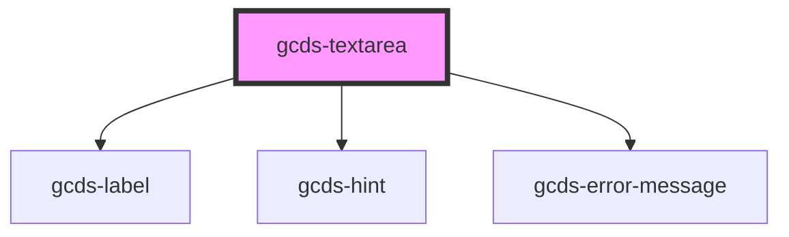

# gcds-textarea

<!-- Auto Generated Below -->

## Properties

| Property                  | Attribute         | Description                                                            | Type                                                | Default     |
| ------------------------- | ----------------- | ---------------------------------------------------------------------- | --------------------------------------------------- | ----------- |
| `blurHandler`             | --                | Custom callback function on blur event                                 | `Function`                                          | `undefined` |
| `changeHandler`           | --                | Custom callback function on change event                               | `Function`                                          | `undefined` |
| `characterCount`          | `character-count` | Sets the maxlength attribute for the textarea element.                 | `number`                                            | `undefined` |
| `cols`                    | `cols`            | Defines width for textarea cols (the min-width for textarea's is 50%). | `number`                                            | `undefined` |
| `disabled`                | `disabled`        | Specifies if a textarea element is disabled or not.                    | `boolean`                                           | `false`     |
| `errorMessage`            | `error-message`   | Error message for an invalid textarea element.                         | `string`                                            | `undefined` |
| `focusHandler`            | --                | Custom callback function on focus event                                | `Function`                                          | `undefined` |
| `hideLabel`               | `hide-label`      | Specifies if the label is hidden or not.                               | `boolean`                                           | `false`     |
| `hint`                    | `hint`            | Hint displayed below the label and above the textarea field.           | `string`                                            | `undefined` |
| `label` _(required)_      | `label`           | Form field label                                                       | `string`                                            | `undefined` |
| `required`                | `required`        | Specifies if a form field is required or not.                          | `boolean`                                           | `false`     |
| `rows`                    | `rows`            | Default value for textarea rows.                                       | `number`                                            | `5`         |
| `textareaId` _(required)_ | `textarea-id`     | Id + name attribute for a textarea element.                            | `string`                                            | `undefined` |
| `validateOn`              | `validate-on`     | Set event to call validator                                            | `"blur" \| "other" \| "submit"`                     | `undefined` |
| `validator`               | --                | Array of validators                                                    | `(string \| ValidatorEntry \| Validator<string>)[]` | `undefined` |
| `value`                   | `value`           | Default value for an input element.                                    | `string`                                            | `undefined` |

## Events

| Event        | Description                                       | Type                  |
| ------------ | ------------------------------------------------- | --------------------- |
| `gcdsBlur`   | Emitted when the textarea loses focus.            | `CustomEvent<void>`   |
| `gcdsChange` | Update value based on user input.                 | `CustomEvent<any>`    |
| `gcdsError`  | Emitted when the textarea has a validation error. | `CustomEvent<object>` |
| `gcdsFocus`  | Emitted when the textarea has focus.              | `CustomEvent<void>`   |
| `gcdsValid`  | Emitted when the textarea has a validation error. | `CustomEvent<object>` |

## Methods

### `validate() => Promise<void>`

Call any active validators

#### Returns

Type: `Promise<void>`

## Dependencies

### Depends on

- [gcds-label](../gcds-label)
- [gcds-hint](../gcds-hint)
- [gcds-error-message](../gcds-error-message)

### Graph

----------------------------------------------

*Built with [StencilJS](https://stenciljs.com/)*
