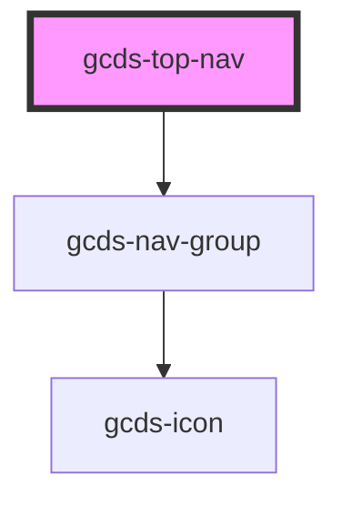

# gcds-top-nav

<!-- Auto Generated Below -->

## Properties

| Property             | Attribute   | Description                   | Type                            | Default     |
| -------------------- | ----------- | ----------------------------- | ------------------------------- | ----------- |
| `alignment`          | `alignment` | Nav alignment                 | `"center" \| "left" \| "right"` | `'left'`    |
| `label` _(required)_ | `label`     | Label for navigation landmark | `string`                        | `undefined` |
| `position`           | `position`  | Sticky navigation flag        | `"static" \| "sticky"`          | `'static'`  |

## Methods

### `updateNavItemQueue(el: any, includeElement?: boolean) => Promise<void>`

#### Returns

Type: `Promise<void>`

### `updateNavSize(size: any) => Promise<void>`

#### Returns

Type: `Promise<void>`

## Dependencies

### Depends on

- [gcds-nav-group](../gcds-nav-group)

### Graph

----------------------------------------------

*Built with [StencilJS](https://stenciljs.com/)*
