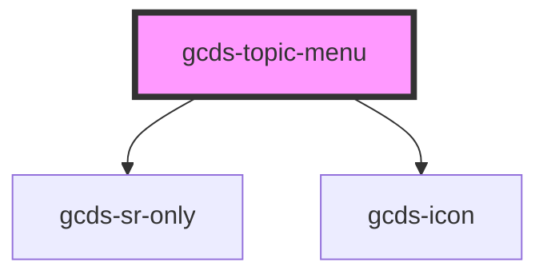

# gcds-topic-menu

<!-- Auto Generated Below -->

## Properties

| Property | Attribute | Description               | Type      | Default |
| -------- | --------- | ------------------------- | --------- | ------- |
| `home`   | `home`    | Sets the homepage styling | `boolean` | `false` |

## Methods

### `closeAllMenus() => Promise<void>`

Close all theme menus

#### Returns

Type: `Promise<void>`

### `getNavSize() => Promise<"desktop" | "mobile">`

#### Returns

Type: `Promise<"desktop" | "mobile">`

### `toggleNav() => Promise<void>`

Toggle open theme and topic menu

#### Returns

Type: `Promise<void>`

### `updateNavItemQueue(parent: any) => Promise<void>`

Update keyboard focus queue

#### Parameters

| Name     | Type  | Description |
| -------- | ----- | ----------- |
| `parent` | `any` |             |

#### Returns

Type: `Promise<void>`

### `updateNavSize(size: any) => Promise<void>`

#### Parameters

| Name   | Type  | Description |
| ------ | ----- | ----------- |
| `size` | `any` |             |

#### Returns

Type: `Promise<void>`

## Dependencies

### Depends on

- [gcds-sr-only](../gcds-sr-only)
- [gcds-icon](../gcds-icon)

### Graph

----------------------------------------------

*Built with [StencilJS](https://stenciljs.com/)*
