# gcds-verify-banner

<!-- Auto Generated Below -->

## Overview

`<gcds-verify-banner>` is a component that displays a banner with information about the Government of Canada's Digital Standards.

## Properties

| Property    | Attribute   | Description                                              | Type                                             | Default |
| ----------- | ----------- | -------------------------------------------------------- | ------------------------------------------------ | ------- |
| `container` | `container` | Defines the container width of the verify banner content | `"full" \| "lg" \| "md" \| "sm" \| "xl" \| "xs"` | `'xl'`  |
| `isFixed`   | `is-fixed`  | Defines if the banner's position is fixed.               | `boolean`                                        | `false` |

## Dependencies

### Depends on

- [gcds-grid](../gcds-grid)

### Graph

```mermaid
graph TD;
  gcds-verify-banner --> gcds-grid
  gcds-grid --> gcds-container
  style gcds-verify-banner fill:#26374a,stroke:#333,stroke-width:4px
```

----------------------------------------------

*Built with [StencilJS](https://stenciljs.com/)*
