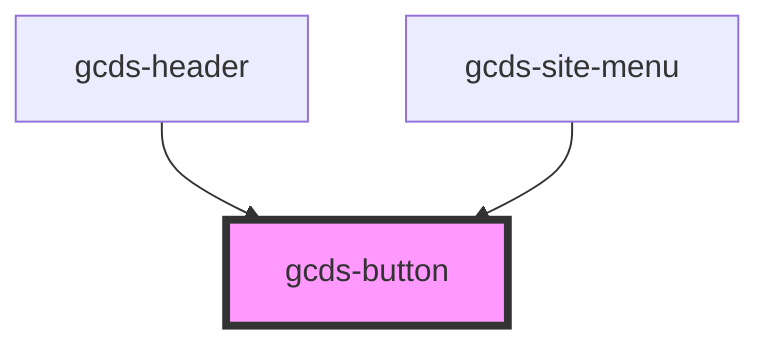

# gcds-button

<!-- Auto Generated Below -->

## Properties

| Property                | Attribute                 | Description                                                                                                                                        | Type                                                             | Default     |
| ----------------------- | ------------------------- | -------------------------------------------------------------------------------------------------------------------------------------------------- | ---------------------------------------------------------------- | ----------- |
| `buttonRole`            | `button-role`             | Set the main style                                                                                                                                 | `"destructive" \| "primary" \| "secondary" \| "skip-to-content"` | `'primary'` |
| `buttonStyle`           | `button-style`            | Set the style variant                                                                                                                              | `"outline" \| "solid" \| "text-only"`                            | `'solid'`   |
| `buttonType`            | `button-type`             | Set button types                                                                                                                                   | `"button" \| "link" \| "reset" \| "submit"`                      | `'button'`  |
| `customBackgroundColor` | `custom-background-color` | StyleAPI: custom background color.                                                                                                                 | `string`                                                         | `undefined` |
| `customBorderColor`     | `custom-border-color`     | StyleAPI: custom border color.                                                                                                                     | `string`                                                         | `undefined` |
| `customBorderStyle`     | `custom-border-style`     | StyleAPI: custom border style.                                                                                                                     | `string`                                                         | `undefined` |
| `customBorderWeight`    | `custom-border-weight`    | StyleAPI: custom border weight.                                                                                                                    | `string`                                                         | `undefined` |
| `customBoxShadow`       | `custom-box-shadow`       | StyleAPI: custom box shadow.                                                                                                                       | `string`                                                         | `undefined` |
| `customCapitalization`  | `custom-capitalization`   | StyleAPI: custom btext transform.                                                                                                                  | `string`                                                         | `undefined` |
| `customDisplay`         | `custom-display`          | StyleAPI: custom display.                                                                                                                          | `string`                                                         | `undefined` |
| `customMargin`          | `custom-margin`           | StyleAPI: custom margin.                                                                                                                           | `string`                                                         | `undefined` |
| `disabled`              | `disabled`                | The disabled attribute for a <button> element.                                                                                                     | `boolean`                                                        | `undefined` |
| `download`              | `download`                | The download attribute specifies that the target (the file specified in the href attribute) will be downloaded when a user clicks on the hyperlink | `string`                                                         | `undefined` |
| `href`                  | `href`                    | The href attribute specifies the URL of the page the link goes to                                                                                  | `string`                                                         | `undefined` |
| `name`                  | `name`                    | The name attribute specifies the name for a <button> element.                                                                                      | `string`                                                         | `undefined` |
| `rel`                   | `rel`                     | The rel attribute specifies the relationship between the current document and the linked document                                                  | `string`                                                         | `undefined` |
| `target`                | `target`                  | The target attribute specifies where to open the linked document                                                                                   | `string`                                                         | `undefined` |

## Events

| Event       | Description                          | Type                |
| ----------- | ------------------------------------ | ------------------- |
| `gcdsBlur`  | Emitted when the button loses focus. | `CustomEvent<void>` |
| `gcdsFocus` | Emitted when the button has focus.   | `CustomEvent<void>` |

## Methods

### `focusElement() => Promise<void>`

Focus element

#### Returns

Type: `Promise<void>`

## Dependencies

### Used by

 - [gcds-header](../gcds-header)
 - [gcds-site-menu](../gcds-site-menu)

### Graph

----------------------------------------------

*Built with [StencilJS](https://stenciljs.com/)*
