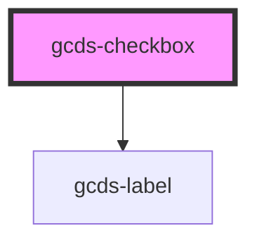

# gcds-checkbox

<!-- Auto Generated Below -->

## Properties

| Property                  | Attribute       | Description | Type      | Default     |
| ------------------------- | --------------- | ----------- | --------- | ----------- |
| `checkboxId` _(required)_ | `checkbox-id`   |             | `string`  | `undefined` |
| `checked`                 | `checked`       |             | `boolean` | `undefined` |
| `disabled`                | `disabled`      |             | `boolean` | `undefined` |
| `errorMessage`            | `error-message` |             | `string`  | `undefined` |
| `hasError`                | `has-error`     |             | `boolean` | `undefined` |
| `label` _(required)_      | `label`         |             | `string`  | `undefined` |
| `name` _(required)_       | `name`          |             | `string`  | `undefined` |
| `required`                | `required`      |             | `boolean` | `undefined` |
| `value`                   | `value`         |             | `string`  | `undefined` |

## Dependencies

### Depends on

- [gcds-label](../gcds-label)

### Graph

----------------------------------------------

*Built with [StencilJS](https://stenciljs.com/)*
