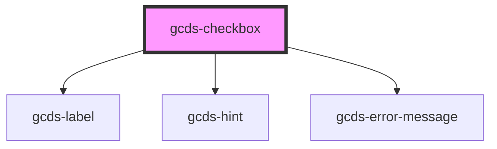

# gcds-checkbox

<!-- Auto Generated Below -->

## Properties

| Property                  | Attribute       | Description                                       | Type      | Default     |
| ------------------------- | --------------- | ------------------------------------------------- | --------- | ----------- |
| `checkboxId` _(required)_ | `checkbox-id`   | Id attribute for an input element.                | `string`  | `undefined` |
| `checked`                 | `checked`       | Specifies if an input element is checked.         | `boolean` | `undefined` |
| `disabled`                | `disabled`      | Specifies if an input element is disabled or not. | `boolean` | `undefined` |
| `errorMessage`            | `error-message` | Error message for an invalid input element.       | `string`  | `undefined` |
| `hasError`                | `has-error`     | Specifies if the input is invalid.                | `boolean` | `undefined` |
| `hint`                    | `hint`          | Hint displayed below the label.                   | `string`  | `undefined` |
| `label` _(required)_      | `label`         | Form field label                                  | `string`  | `undefined` |
| `name` _(required)_       | `name`          | Name attribute for an input element.              | `string`  | `undefined` |
| `required`                | `required`      | Specifies if a form field is required or not.     | `boolean` | `undefined` |
| `value`                   | `value`         | Value for an input element.                       | `string`  | `undefined` |

## Dependencies

### Depends on

- [gcds-label](../gcds-label)
- [gcds-hint](../gcds-hint)
- [gcds-error-message](../gcds-error-message)

### Graph

----------------------------------------------

*Built with [StencilJS](https://stenciljs.com/)*
