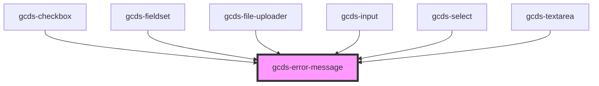

# gcds-error-message

<!-- Auto Generated Below -->

## Properties

| Property    | Attribute    | Description                              | Type     | Default     |
| ----------- | ------------ | ---------------------------------------- | -------- | ----------- |
| `message`   | `message`    | Error message for an invalid form field. | `string` | `undefined` |
| `messageId` | `message-id` | Id attribute for the error message.      | `string` | `undefined` |

## Dependencies

### Used by

 - [gcds-checkbox](../gcds-checkbox)
 - [gcds-fieldset](../gcds-fieldset)
 - [gcds-file-uploader](../gcds-file-uploader)
 - [gcds-input](../gcds-input)
 - [gcds-select](../gcds-select)
 - [gcds-textarea](../gcds-textarea)

### Graph

----------------------------------------------

*Built with [StencilJS](https://stenciljs.com/)*
