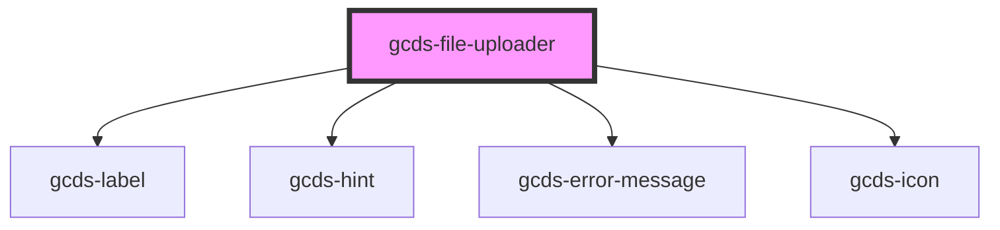

# gcds-file-uploader

<!-- Auto Generated Below -->

## Properties

| Property                  | Attribute       | Description                                                                 | Type       | Default     |
| ------------------------- | --------------- | --------------------------------------------------------------------------- | ---------- | ----------- |
| `accept`                  | `accept`        | Defines the file types the file uploader accepts.                           | `string`   | `undefined` |
| `disabled`                | `disabled`      | Specifies if a file uploader element is disabled or not.                    | `boolean`  | `undefined` |
| `errorMessage`            | `error-message` | Error message for an invalid file uploader element.                         | `string`   | `undefined` |
| `hasError`                | `has-error`     | Specifies if the file uploader is invalid.                                  | `boolean`  | `undefined` |
| `hint`                    | `hint`          | Hint displayed below the label.                                             | `string`   | `undefined` |
| `label` _(required)_      | `label`         | Form field label.                                                           | `string`   | `undefined` |
| `multiple`                | `multiple`      | Boolean that specifies if the user is allowed to select more than one file. | `boolean`  | `undefined` |
| `required`                | `required`      | Specifies if a form field is required or not.                               | `boolean`  | `undefined` |
| `uploaderId` _(required)_ | `uploader-id`   | Id attribute for a file uploader element.                                   | `string`   | `undefined` |
| `value`                   | --              | Value for a file uploader element.                                          | `string[]` | `[]`        |

## Events

| Event                    | Description                           | Type               |
| ------------------------ | ------------------------------------- | ------------------ |
| `gcdsFileUploaderChange` | Update value based on user selection. | `CustomEvent<any>` |
| `gcdsRemoveFile`         | Remove file and update value.         | `CustomEvent<any>` |

## Dependencies

### Depends on

- [gcds-label](../gcds-label)
- [gcds-hint](../gcds-hint)
- [gcds-error-message](../gcds-error-message)
- [gcds-icon](../gcds-icon)

### Graph

----------------------------------------------

*Built with [StencilJS](https://stenciljs.com/)*
