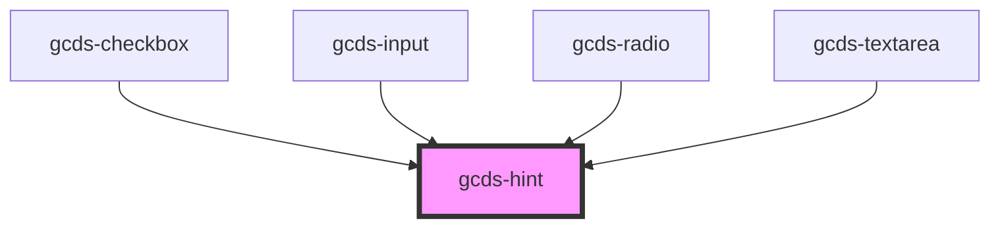

# gcds-hint

<!-- Auto Generated Below -->

## Properties

| Property | Attribute | Description                                               | Type     | Default     |
| -------- | --------- | --------------------------------------------------------- | -------- | ----------- |
| `hint`   | `hint`    | Hint displayed below the label and above the input field. | `string` | `undefined` |
| `hintId` | `hint-id` | Id attribute for the hint.                                | `string` | `undefined` |

## Dependencies

### Used by

 - [gcds-checkbox](../gcds-checkbox)
 - [gcds-input](../gcds-input)
 - [gcds-radio](../gcds-radio)
 - [gcds-textarea](../gcds-textarea)

### Graph

----------------------------------------------

*Built with [StencilJS](https://stenciljs.com/)*
