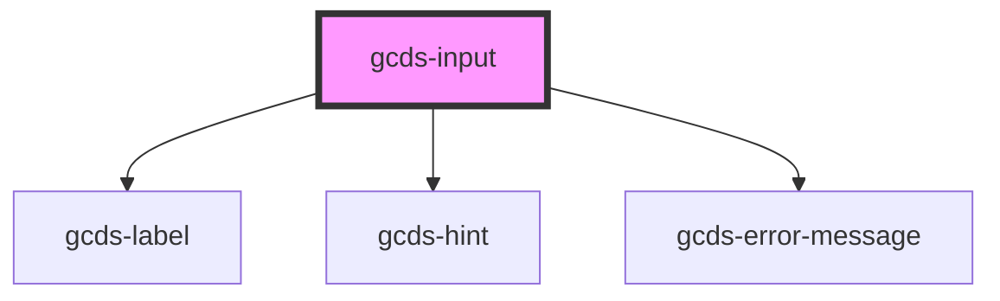

# gcds-input

<!-- Auto Generated Below -->

## Properties

| Property       | Attribute       | Description                                               | Type                                                               | Default     |
| -------------- | --------------- | --------------------------------------------------------- | ------------------------------------------------------------------ | ----------- |
| `disabled`     | `disabled`      | Specifies if an input element is disabled or not.         | `boolean`                                                          | `false`     |
| `errorMessage` | `error-message` | Error message for an invalid input element.               | `string`                                                           | `undefined` |
| `hideLabel`    | `hide-label`    | Specifies if the label is hidden or not.                  | `boolean`                                                          | `undefined` |
| `hint`         | `hint`          | Hint displayed below the label and above the input field. | `string`                                                           | `undefined` |
| `inputId`      | `input-id`      | Id + name attribute for an input element.                 | `string`                                                           | `undefined` |
| `label`        | `label`         | Form field label                                          | `string`                                                           | `undefined` |
| `required`     | `required`      | Specifies if a form field is required or not.             | `boolean`                                                          | `undefined` |
| `size`         | `size`          | Size attribute for an input element.                      | `number`                                                           | `undefined` |
| `type`         | `type`          | Set Input types                                           | `"email" \| "number" \| "password" \| "search" \| "text" \| "url"` | `'text'`    |
| `value`        | `value`         | Default value for an input element.                       | `string`                                                           | `undefined` |

## Events

| Event        | Description                         | Type                |
| ------------ | ----------------------------------- | ------------------- |
| `gcdsBlur`   | Emitted when the input loses focus. | `CustomEvent<void>` |
| `gcdsChange` | Update value based on user input.   | `CustomEvent<any>`  |
| `gcdsFocus`  | Emitted when the input has focus.   | `CustomEvent<void>` |

## Dependencies

### Depends on

- [gcds-label](../gcds-label)
- [gcds-hint](../gcds-hint)
- [gcds-error-message](../gcds-error-message)

### Graph

----------------------------------------------

*Built with [StencilJS](https://stenciljs.com/)*
