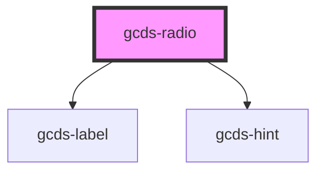

# gcds-radio

<!-- Auto Generated Below -->

## Properties

| Property               | Attribute  | Description                                       | Type      | Default     |
| ---------------------- | ---------- | ------------------------------------------------- | --------- | ----------- |
| `checked`              | `checked`  | Specifies if an input element is checked.         | `boolean` | `undefined` |
| `disabled`             | `disabled` | Specifies if an input element is disabled or not. | `boolean` | `undefined` |
| `hint`                 | `hint`     | Hint displayed below the label.                   | `string`  | `undefined` |
| `label` _(required)_   | `label`    | Form field label                                  | `string`  | `undefined` |
| `name` _(required)_    | `name`     | Name attribute for an input element.              | `string`  | `undefined` |
| `radioId` _(required)_ | `radio-id` | Id attribute for an input element.                | `string`  | `undefined` |
| `required`             | `required` | Specifies if a form field is required or not.     | `boolean` | `undefined` |
| `value`                | `value`    | Value for an input element.                       | `string`  | `undefined` |

## Events

| Event             | Description                              | Type                |
| ----------------- | ---------------------------------------- | ------------------- |
| `gcdsBlur`        | Emitted when the radio loses focus.      | `CustomEvent<void>` |
| `gcdsFocus`       | Emitted when the radio has focus.        | `CustomEvent<void>` |
| `gcdsRadioChange` | Emitted when the radio button is checked | `CustomEvent<void>` |

## Dependencies

### Depends on

- [gcds-label](../gcds-label)
- [gcds-hint](../gcds-hint)

### Graph

----------------------------------------------

*Built with [StencilJS](https://stenciljs.com/)*
