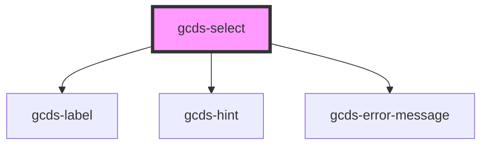

# gcds-select

<!-- Auto Generated Below -->

## Properties

| Property                | Attribute       | Description                                                                                   | Type      | Default     |
| ----------------------- | --------------- | --------------------------------------------------------------------------------------------- | --------- | ----------- |
| `defaultValue`          | `default-value` | The default value is an optional value that gets displayed before the user selects an option. | `string`  | `undefined` |
| `disabled`              | `disabled`      | Specifies if a select element is disabled or not.                                             | `boolean` | `undefined` |
| `errorMessage`          | `error-message` | Error message for an invalid select element.                                                  | `string`  | `undefined` |
| `hasError`              | `has-error`     | Specifies if the select is invalid.                                                           | `boolean` | `undefined` |
| `hint`                  | `hint`          | Hint displayed below the label.                                                               | `string`  | `undefined` |
| `label` _(required)_    | `label`         | Form field label.                                                                             | `string`  | `undefined` |
| `required`              | `required`      | Specifies if a form field is required or not.                                                 | `boolean` | `undefined` |
| `selectId` _(required)_ | `select-id`     | Id attribute for a select element.                                                            | `string`  | `undefined` |
| `value`                 | `value`         | Value for a select element.                                                                   | `string`  | `undefined` |

## Events

| Event              | Description                           | Type               |
| ------------------ | ------------------------------------- | ------------------ |
| `gcdsSelectChange` | Update value based on user selection. | `CustomEvent<any>` |

## Dependencies

### Depends on

- [gcds-label](../gcds-label)
- [gcds-hint](../gcds-hint)
- [gcds-error-message](../gcds-error-message)

### Graph

----------------------------------------------

*Built with [StencilJS](https://stenciljs.com/)*
