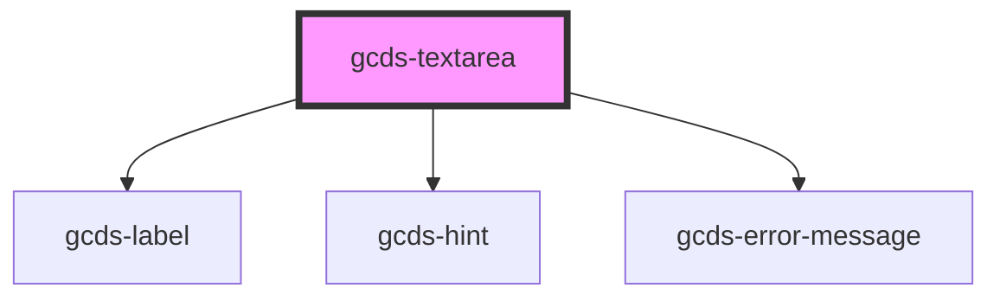

# gcds-textarea

<!-- Auto Generated Below -->

## Properties

| Property                 | Attribute                  | Description                                                  | Type      | Default     |
| ------------------------ | -------------------------- | ------------------------------------------------------------ | --------- | ----------- |
| `disabled`               | `disabled`                 | Specifies if a textarea element is disabled or not.          | `boolean` | `false`     |
| `errorMessage`           | `error-message`            | Error message for an invalid textarea element.               | `string`  | `undefined` |
| `hideLabel`              | `hide-label`               | Specifies if the label is hidden or not.                     | `boolean` | `undefined` |
| `label`                  | `label`                    | Form field label                                             | `string`  | `undefined` |
| `required`               | `required`                 | Specifies if a form field is required or not.                | `boolean` | `undefined` |
| `textareaCharacterCount` | `textarea-character-count` | Sets the maxlength attribute for the textarea element.       | `number`  | `undefined` |
| `textareaCols`           | `textarea-cols`            | Default value for textarea cols.                             | `number`  | `45`        |
| `textareaHint`           | `textarea-hint`            | Hint displayed below the label and above the textarea field. | `string`  | `undefined` |
| `textareaId`             | `textarea-id`              | Id + name attribute for a textarea element.                  | `string`  | `undefined` |
| `textareaRows`           | `textarea-rows`            | Default value for textarea rows.                             | `number`  | `5`         |
| `textareaValue`          | `textarea-value`           | Default value for a textarea element.                        | `string`  | `undefined` |

## Events

| Event       | Description                            | Type                |
| ----------- | -------------------------------------- | ------------------- |
| `gcdsBlur`  | Emitted when the textarea loses focus. | `CustomEvent<void>` |
| `gcdsFocus` | Emitted when the textarea has focus.   | `CustomEvent<void>` |

## Dependencies

### Depends on

- [gcds-label](../gcds-label)
- [gcds-hint](../gcds-hint)
- [gcds-error-message](../gcds-error-message)

### Graph

----------------------------------------------

*Built with [StencilJS](https://stenciljs.com/)*
