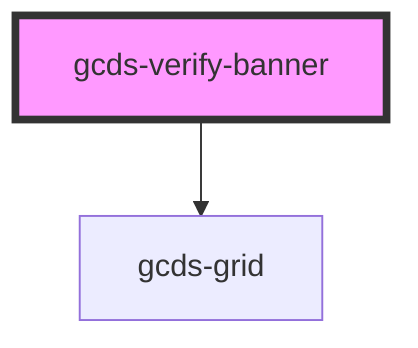

# gcds-verify-banner

<!-- Auto Generated Below -->

## Properties

| Property          | Attribute           | Description                                 | Type                                      | Default     |
| ----------------- | ------------------- | ------------------------------------------- | ----------------------------------------- | ----------- |
| `maxContentWidth` | `max-content-width` | Defines the max width of the banner content | `"fluid" \| "lg" \| "md" \| "sm" \| "xs"` | `'lg'`      |
| `positionFixed`   | `position-fixed`    | Defines if the banner's position is fixed.  | `boolean`                                 | `undefined` |

## Dependencies

### Depends on

- [gcds-grid](../gcds-grid)

### Graph

----------------------------------------------

*Built with [StencilJS](https://stenciljs.com/)*
